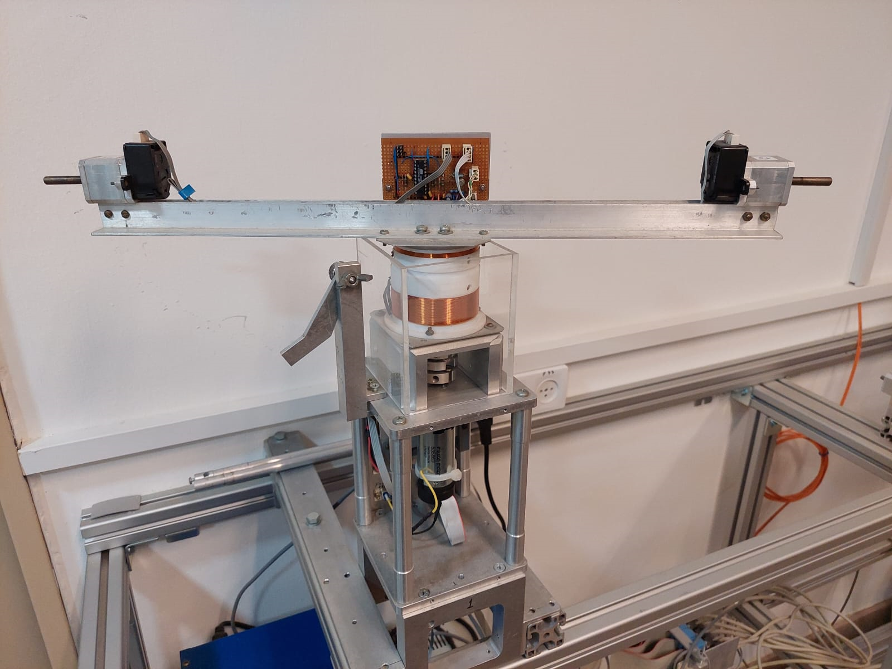
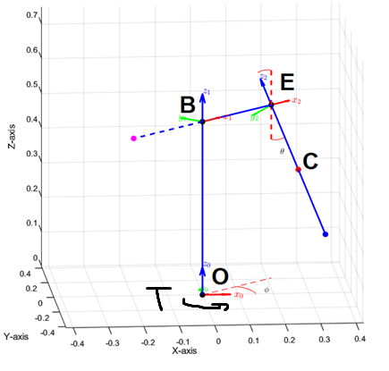
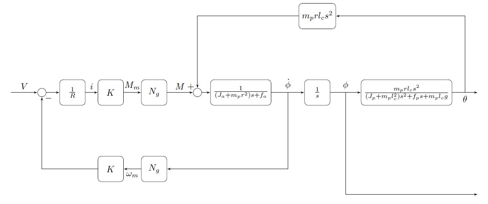
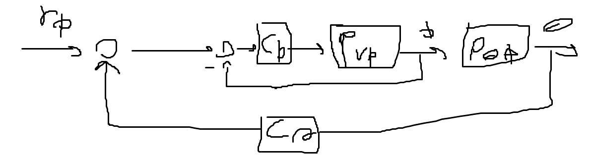
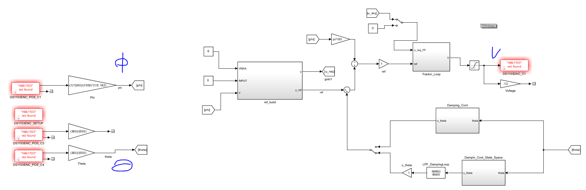

# Control of a Furuta Pendulum - Final Project

This project was developed as part of my undergraduate final project at the Technion, in collaboration with my partner Igal Vornov and under the supervision of Prof. Leonid Mirkin.

The system under study consists of a brushed DC motor actuator that drives a rotating arm with a pendulum attached to its end. The project's objectives and stages are as follows:

  
   Furuta Pendulum experimental system

  
   Mechanical model of the arm-pendulum system

---

## Project Overview

- **Full System Modeling:** 
  - Modeling using Lagrangian equations.
  - Modeling of the brushed DC motor.
  
- **System Linearization:**
  - Linearizing the system around the lower and upper equilibrium points.

- **Controller Design:**
  - Designing various controllers to achieve multiple tasks.
  - Experimenting with loop-shaping control and different optimization techniques.

  
   Block diagram of the overall control system

---

## Current Progress

### 1. Tracking Control for the Arm Angle
- Initially implemented a simple gain-based tracking controller, which functioned but showed limited performance.
- Improved performance by designing a loop-shaped tracking controller. However, saturation issues (nonlinear behavior) appeared.

### 2. Bang-Bang Reference Signal
- Instead of a smoothed step input, we designed an optimal bang-bang reference signal, resulting in a bang-bang control voltage within specified limits.

### 3. Feedforward Control (2DOF)
- Added feedforward control to improve tracking, reducing overshoot (OS). However, the arm still oscillated at the pendulum's natural frequency.
- To address this, we introduced a damping controller.

### 4. Cascade Control with Damping
- Designed a damping controller layered on top of the tracking controller to suppress pendulum oscillations during arm tracking.
- This cascade structure slightly degraded the tracking controller's performance but overall led to acceptable steady target acquisition in laboratory tests.

  
   Control scheme: Tracking controller combined with damping controller

### 5. LQG-Based Damping Controller
- Further improved damping by designing a controller based on an LQG (Linear-Quadratic-Gaussian) optimization problem with defined weighting TF.
- Resulted in a more complex but smoother continuous damping controller with improved suppression performance.

### 6. Switched (Intermittent) Control Implementation
- We are now converting the continuous control into a switched control scheme.
- This involves decomposing the damping controller back into an observer and a state feedback controller, sampling them independently, and using a sample-and-hold structure for the system's state vector.

  
   Control scheme: Simulink Control scheme used in Lab, with encoders inputs and voltage output

---

## Future Plans

- Apply the same methods developed for arm tracking around the lower equilibrium to:
  - Stabilize the pendulum in the upright position.
  - Implement a swing-up controller to move the pendulum from the downward to the upward position.

---

## Repository Contents

- `project_v1.pdf` — Full project description and documentation.

---

## Acknowledgments

- Supervisor: **Prof. Leonid Mirkin**
- Project Partner: **Igal Vornov**

---
